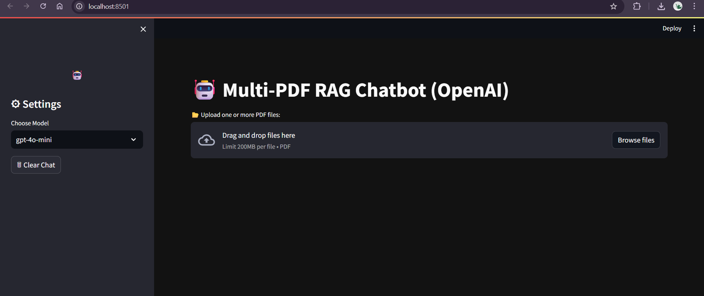
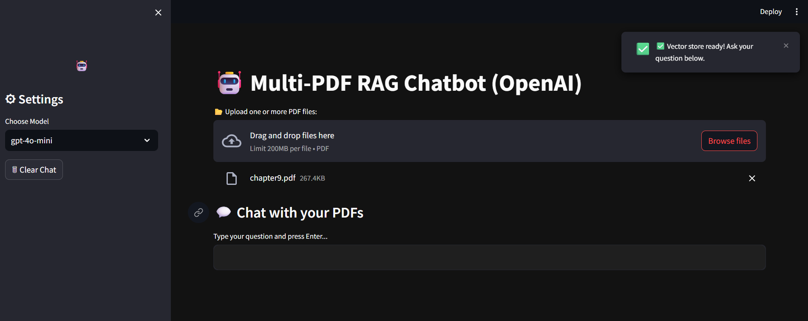
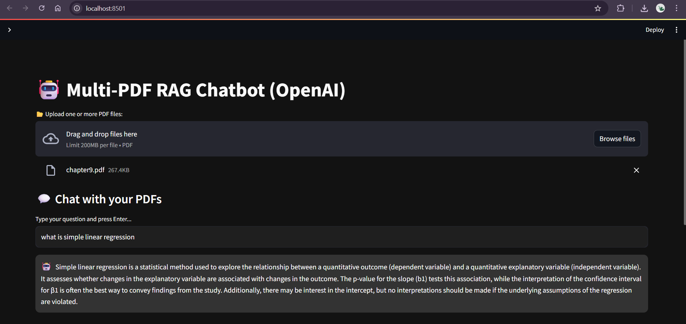

# Multi-PDF RAG Chatbot using OpenAI and LangChain

A Retrieval-Augmented Generation (RAG) chatbot built with **OpenAI GPT models**, **LangChain**, and **Streamlit**.  
This application allows users to upload multiple PDF documents, ask natural language questions, and get accurate answers with sources.

---

## Features
- Upload multiple PDF documents  
- Extract, split, and store text in a vector database (ChromaDB)  
- Ask questions and get context-aware answers  
- Dark Mode UI for professional look  
- Chat history with previous questions and answers  
- Real-time typing effect for answers  
- Powered by OpenAI GPT models (gpt-4o-mini / gpt-4 / gpt-3.5)

---

## Screenshots

### Home Page


### PDF Upload


### Chat Interface


---

## Demo Video

[](https://www.youtube.com/watch?v=YOUR_VIDEO_ID)

Click the thumbnail above to watch the full demo on YouTube.

---

## Tech Stack
- **Python 3.10+**
- [Streamlit](https://streamlit.io/) - UI Framework
- [LangChain](https://www.langchain.com/) - RAG Pipeline
- [OpenAI API](https://platform.openai.com/) - GPT Models & Embeddings
- [ChromaDB](https://www.trychroma.com/) - Vector Database
- [PyPDF](https://pypi.org/project/pypdf/) - PDF Text Extraction

---

## Installation & Setup

### 1. Clone the Repository
```bash
git clone https://github.com/your-username/multi-pdf-rag-chatbot.git
cd multi-pdf-rag-chatbot

## 2. Create Virtual Environment & Install Dependencies

python -m venv RAGBot
source RAGBot/bin/activate   # (On Mac/Linux)
RAGBot\Scripts\activate      # (On Windows)

pip install -r requirements.txt

3. Add OpenAI API Key

Create a .env file in the root directory:
